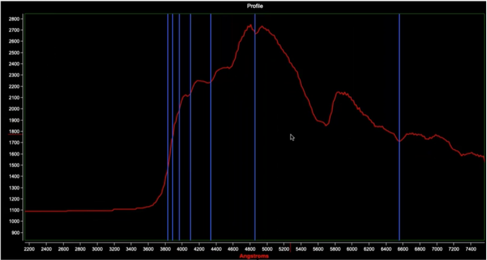

# Astrometry
Astrometry is the science which deals with the positions and motions of celestial objects. Astrometry is now one of many fields of research within astronomy. Historically, astrometry was all that astronomy was about until about the 19th century. Toward the end of the 19th century not only the directions, i.e. angles between celestial objects as seen on the celestial sphere were measured but also the "quality of light", specifically the light intensity (photometry) and color (spectroscopy, light intensity as function of color or wavelength). This was the birth of astrophysics. The term astrophysics, often used to distinguish most of current astronomical research from the classical astronomy (i.e. astrometry) is misleading, because astrometry also is certainly part of physics or astrophysics. Measurements of distances to celestial objects by triangulation for example is at the core of astrometry and it forms the basis of all astrophysics; without knowing the distances to planets, satellites, stars, and galaxies, no correct understanding of the cosmos in which we live can be achieved.

## Project: Obtain Analyse and Publish Spectroscopic measurements of stars

### An example of telescopic data we might gather anayze and publish
See below is the spectra obtained from a star called Minelauva - a Red Giant star (Delta Virgnis) in the constellation Virgo.  It is a cool M-Type star burning Helium into Carbon and Oxygen in its core. It has a temparature of around 4,000 Kelvin on it's surface. It's atmosphere shows strong absorption lines of Titanium Oxide.  Note the fantastic agreement between the spectral lines obtained through the telescope and those of the standard absorption lines of Titanium oxide! 

## Expectations
1. Gather spectral images of multple targets (stars and planets) through the Bush Telescope in night-time observing sessions using a diffraction grating. 
1. Expecting about 4-6 observing sessions.
1. Process images via stacking to improve signal to noise ratio
1. Analyse the processed spectra in the RSpec software.
1. Identify the spectral lines and the chemical composition of the stars and planets that created them.
1. Identify any displacement of the spectral lines when compared to the standard spectrum to rotation of planets (doppler efffect) of gaseous envelope expansion in Wolf Rayet stars.
1. Create a poster and/or paper documenting and submitting results for publication in the Atom, JAAVSO journals etc.
1. Expect a combination of hands-on observing sessions, in-classroom lecture sessions and online meetings
1. Expect this to take 6 months or so with about a dozen sessions to prepare a paper for publication

## Participants
1. 
1. 
1. 

## References
1. 
1. 

## Jupyter Notebooks
1. 
1. 

