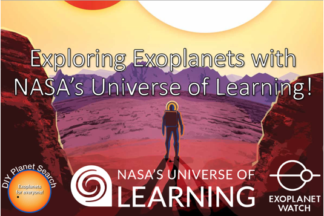

# Photometry
The process of measuring the  brightness of stars is called photometry.  In this section, we will list projects that concern measuring the intrinsic brightness (energy output) of stars, the nature of light - i.e wavelength, frequency, and viariability of stars in general.  This section will also include projects relating to speckle interferometry of double stars and spectroscopic analysis of starlight.

## Project: Assign Analyse and Publish Light Curves of Exoplanets
### An example of exoplanetary data from remote telecopes, plot light curves and publish

When you look up into the night sky, do you wonder what's out there beyond our solar system? So do we! Come join us in learning more about exoplanets, the worlds that orbit distant stars.

## Expectations
1. Obtain exoplanetary transits of multple star targets (stars and planets) from amateur astronomers for analysis. 
1. Expecting about 4-6 targets in total.
1. Practice processing sample images via the NASA EXOTIC program (adapted for JupyterLab by Chandru)
1. Process assigned targets images via the NASA EXOTIC program (adapted for JupyterLab by Chandru)
1. Plot the Light Curves in JupyterLab.
1. Calculate various planetary and stellar parameters such as mass of central star, orbital characteristics of planet, diameter of star & planet and much more.
1. Compare our results to previous observations.
1. Create a poster and/or paper documenting results for publication in the NASA exoplanet archive and other journals.
1. Expect a combination of in-classroom lecture sessions and online meetings
1. Expect this to take 6 months or so with about a 8-10 sessions to prepare a paper for publication

## Participants
1. 
1. 
1. 

## References
1. 
1. 

## Jupyter Notebooks
1. 
1. 

