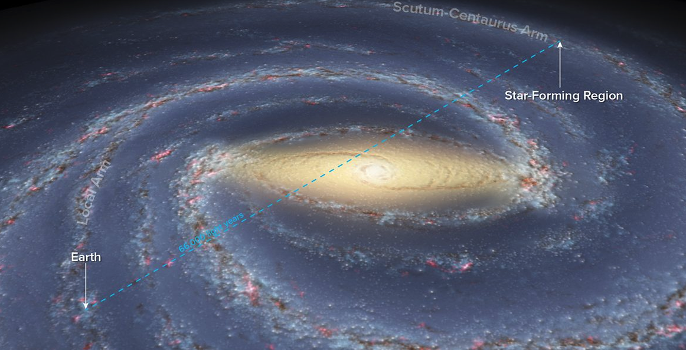

# Citizen_Science_Projects
The GitHub repository for Citizen Science Projects in Astronomy & Computing targeted at High/Middle school students

## [Astrometry Projects](Astrometry)
## [Photometry Projects](Photometry)
## [Basics JupyterLab Notebooks](notebooks/basics_jupyterlab_notebook/)
## [Stellar Luminosity Magnitudes & Logarithms Notebooks](notebooks/star_magnitudes/)

## Google Meeting Links and Recording Links 

Item|Date|Agenda|Google Meet Link|Google Recording Link
---|---|---|---|---|
1|Mon, Nov 20th, 2023 6:00 - 7:00 PM|Intro & Roles|[Google Meet link](https://meet.google.com/hwo-ttfv-smv)|[Google Meeting Recording](https://drive.google.com/file/d/1vIJC9bdARp3I229-IrN4-zbeXCbpur00/view?usp=sharing)
2|Mon, Nov 27th, 2023 6:00 - 7:00 PM|Project Selection|[Google Meet link](https://meet.google.com/hwo-ttfv-smv)|[Google Meeting Recording](https://drive.google.com/file/d/13SBWboNWtZF7jt3Uz5Gcj3RXyonkTKUX/view?usp=sharing)
3|Thu, Dec 14th, 2023 6:00 - 7:00 PM|Theory & Jupyter Notebooks for our CS projects - session 1|[Google Meet link](https://meet.google.com/hwo-ttfv-smv)|[Google Meeting Recording](https://drive.google.com/file/d/10PReT9n9Wh5GtrnN-rOXM2sU3dN4GHwG/view?usp=sharing)
4|Thu, Dec 21st, 2023 6:00 - 7:30 PM|Stellar Luminosity Magnitudes & Logarithms - session 2|[Google Meet link](https://meet.google.com/hwo-ttfv-smv)|[Google Meeting Recording](TBA)
